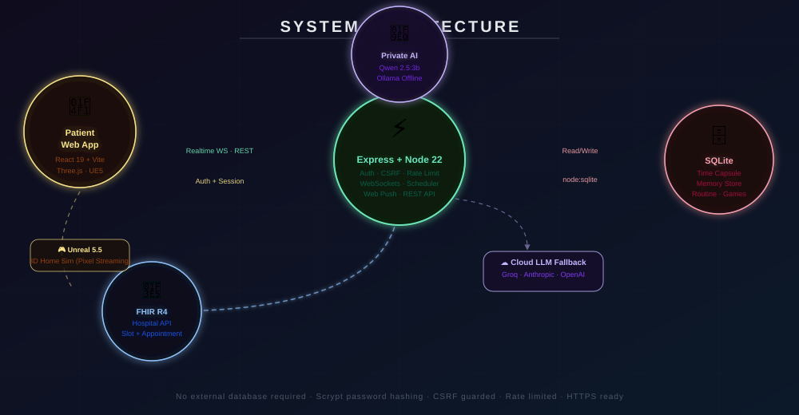
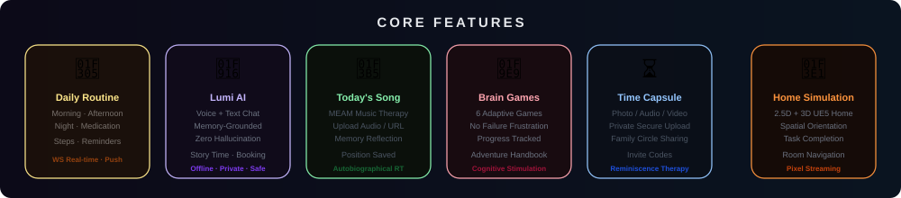
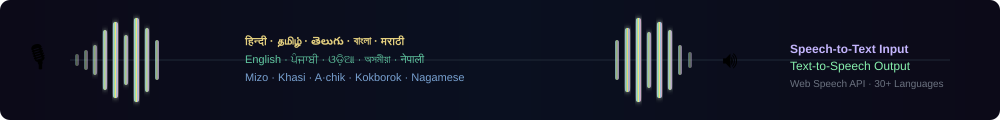

<p align="center">
  
</p>

<p align="center">
  <!-- Core tech badges -->
  
  
  
  
  
  <br/>
  
  
  
  
  
</p>

<p align="center">
  <strong>🌐 30+ Regional Languages</strong> &nbsp;·&nbsp;
  <strong>🔒 100% Offline AI Privacy</strong> &nbsp;·&nbsp;
  <strong>🏥 FHIR R4 Hospital Integration</strong> &nbsp;·&nbsp;
  <strong>🧠 Zero-Hallucination Grounded AI</strong>
</p>

<p align="center">
  <a href="#-the-problem">🧠 The Problem</a> ·
  <a href="#-solution-overview">💡 Solution</a> ·
  <a href="#️-system-architecture">🏗️ Architecture</a> ·
  <a href="#-core-features">🌟 Features</a> ·
  <a href="#-multilingual-voice-30-regional-languages">🎙️ 30+ Languages</a> ·
  <a href="#-quick-start">🚀 Quick Start</a> ·
  <a href="#️-configuration">⚙️ Config</a> ·
  <a href="#-impact--clinical-rationale">📊 Impact</a>
</p>

---

## 🧠 The Problem

> **55 million people worldwide live with dementia.** By 2050, this number will triple to **153 million**.

Dementia is not just memory loss — it is the **gradual erosion of identity, independence, and connection**. Patients face:

| Challenge | Impact |
|---|---|
| Sundowning Syndrome | Severe anxiety, disorientation at dusk |
| Medication Non-Adherence | Up to 70% miss doses, accelerating decline |
| Social Isolation | Linked to 60% faster cognitive deterioration |
| Caregiver Burnout | Families lack remote monitoring tools |
| Language Barriers | Most apps English-only; marginalizes 80%+ of Indian patients |
| Clinical Friction | Booking hospital appointments is overwhelmingly complex |

**Existing solutions** are English-only, clinically sterile, or require expensive external databases. They fail the very people they claim to serve.

---

## 💡 Solution Overview

**Recallia Quest** is a **patient-facing, dementia-friendly adventure app** — built on clinical evidence from **Reminiscence Therapy (RT)** and **Music-Evoked Autobiographical Memory (MEAM)** research — that brings together:

- 🌅 **Structured daily routines** with medication reminders & real-time push notifications
- 🤖 **Lumi**, a warm, grounded AI companion with **zero-hallucination guardrails**
- 🎵 **Today's Song** — music therapy with autobiographical memory reflection
- 🧩 **6 adaptive brain games** designed to stimulate without causing failure-frustration
- ⏳ **Time Capsule** — private intergenerational memory archive for families
- 🏡 **2.5D + 3D Unreal Engine 5.5 Home Simulation** for spatial orientation therapy
- 🏥 **Autonomous FHIR R4 hospital appointment booking** — no cognitive burden on patients
- 🌐 **30+ regional languages** including 20+ Northeast Indian minority languages

All of this works **entirely offline** with a private local AI model — **no data leaves the device**.

---

## 🏗️ System Architecture

<p align="center">
  
</p>

### Dual-Engine AI Architecture

```
Patient Request
     │
     ▼
[Express Server] ── Grounding Check (verified family memories only)
     │
     ├──▶ [Private Qwen 2.5:3b via Ollama]  ← Offline · HIPAA/GDPR Safe · No cost
     │         │ (if fails validation)
     └──▶ [Cloud LLM Fallback]             ← Anthropic / OpenAI / Groq (configurable)
               │
               ▼
         Story validation pipeline
         Dropped hallucinations → composer fallback
```

> **Key innovation:** Lumi's responses are validated against the patient's own Time Capsule memories before delivery. Any response that cannot be grounded in verified family data is silently dropped and regenerated — **making hallucinations impossible to reach the patient.**

### Data Flow Security

```
Browser ──HTTPS──▶ Express (CSRF guard + rate limit + httpOnly sessions)
                        │
                  node:sqlite (scrypt-hashed passwords, per-user isolation)
                        │
                  Encrypted uploads (served only to authorized users)
```

---

## 🌟 Core Features

<p align="center">
  
</p>

### 🌅 Daily Routine & Medication Management
- Morning · Afternoon · Night routines with recurring day support
- Multi-step medication with visual confirmation
- **Server-side scheduler** fires every 15s → real-time WebSocket popup + Web Push (VAPID auto-generated)
- Family carers receive cross-device sync in real time

### 🤖 Lumi — The AI Companion
- **Voice + text conversation** in 30+ languages
- **Memory-grounded responses** — Lumi references the patient's own Time Capsule
- **Grounding validation pipeline** — 0 hallucinations reach the patient
- Story Time: co-creates personalized narratives from real memories
- Appointment Helper: books hospital slots via FHIR R4 API conversationally

### 🎵 Today's Song — Music Therapy (MEAM)
- Upload any audio file or paste a YouTube/Spotify/HTTPS link
- Playback position remembered across sessions
- Memory Reflection: patient records thoughts, feelings, and associated memories
- Clinical basis: **Music-Evoked Autobiographical Memory** (MEAM) proven to reduce anxiety and improve recall

### 🧩 6 Adaptive Brain Games
| Game | Cognitive Domain |
|---|---|
| Word Match | Language & Recall |
| Sequence Recall | Working Memory |
| Photo Recognition | Episodic Memory |
| Pattern Tiles | Visual Processing |
| Number Pairs | Numeric Cognition |
| Story Recall | Narrative Memory |

All games have **no time pressure** and **no explicit failure states** — aligned with dementia-care best practices.

### ⏳ Time Capsule & Family Circle
- Private upload of **photos, audio clips, videos, and written notes**
- Family members join via **one-time invite codes**
- Real-time presence indicators, read receipts, and cross-device sync
- Grounding source for Lumi AI — only verified family content informs AI responses

### 🏡 Home Simulation (2.5D + 3D)
- **2.5D SVG-based** interactive home available on all devices out-of-the-box
- **Unreal Engine 5.5 Pixel Streaming** 3D photorealistic home (when configured)
- Spatial orientation tasks: navigate rooms, complete daily chores, recall object locations
- Voice-guided exploration with Lumi as the narrator

### 🏥 FHIR R4 Hospital Integration
- Autonomous appointment booking via natural conversation with Lumi
- Searches real hospital slots via FHIR Slot resource
- Creates `Appointment` resources in the hospital's EHR system
- Zero cognitive friction — the patient simply says *"I need to see Dr. Sharma"*

---

## 🎙️ Multilingual Voice — 30+ Regional Languages

<p align="center">
  
</p>

| Group | Languages |
|---|---|
| **Core** | English · Hindi · Tamil · Telugu · Malayalam |
| **Northeast** | Assamese · Nepali · Manipuri · Khasi · Garo · Nagamese · Ao · Angami · Bodo · Kokborok |
| **Sikkim** | Sikkimese (Bhutia) · Lepcha · Sherpa |
| **Himalayan** | Limbu |
| **North-Assam (Tani)** | Apatani · Aka · Dafla · Galo · Mishing · Adi |
| **Kuki-Chin** | Mizo · Thadou · Paite · Hmar · Kom · Zou · Vaiphei |

> Speech recognition and synthesis use the **Web Speech API** with automatic voice fallback for less common scripts. The AI companion replies in the patient's chosen language.

---

## 🔒 Privacy & Offline-First Architecture

| Property | Detail |
|---|---|
| **Local AI inference** | Qwen 2.5:3b via Ollama — runs entirely on-device |
| **No external DB** | SQLite `node:sqlite` built into Node 22 — zero external dependencies |
| **Password hashing** | scrypt (memory-hard, OWASP recommended) |
| **Session security** | httpOnly cookies + CSRF guard + SameSite strict |
| **Upload isolation** | Files served only to the authenticated user or their approved family circle |
| **Rate limiting** | Per-IP limits on all write endpoints |
| **HTTPS ready** | `TRUST_PROXY`, `COOKIE_SECURE`, and HSTS supported |
| **Content Security Policy** | Strict CSP in production; blocks XSS |

---

## 🚀 Quick Start

### Windows (One Click)
```
Double-click start.bat
```
Installs · Builds · Starts · Opens Chrome at http://localhost:8787

### macOS / Linux
```bash
./start.sh
```

### Development (Hot Reload)
```bash
git clone https://github.com/Abdulwaheedkhan003/recallia-quest.git
cd recallia-quest
npm install
cp .env.example .env         # Add your AI key (optional)
npm run dev                  # API :8787 + Vite HMR :5173 → http://localhost:5173
```

### Production Build
```bash
npm run build && npm start   # Everything on http://localhost:8787
```

**Requires:** Node.js ≥ 22.13 (uses built-in `node:sqlite`)

---

## ⚙️ Configuration

Copy `.env.example` to `.env` and configure:

```env
# ── Server ──────────────────────────────────────────────
PORT=8787
APP_ORIGIN=http://localhost:5173

# ── AI (Companion, Story Time, Appointment Helper) ──────
# Option A: Anthropic
AI_PROVIDER=anthropic
ANTHROPIC_API_KEY=sk-ant-...
ANTHROPIC_MODEL=claude-sonnet-4-5

# Option B: OpenAI / Groq / Ollama / LM Studio
AI_PROVIDER=openai
OPENAI_BASE_URL=https://api.groq.com/openai/v1
OPENAI_API_KEY=gsk_...
OPENAI_MODEL=llama-3.3-70b-versatile

# Option C: Private Local AI (Ollama on this machine — free, zero-cost)
# Runs automatically if Ollama is installed and qwen2.5:3b is pulled
# ollama pull qwen2.5:3b

# ── Hospital FHIR R4 Integration ─────────────────────────
FHIR_BASE_URL=https://hospital.example.org/fhir
FHIR_BEARER_TOKEN=eyJ...

# ── 3D Home (Unreal Engine 5.5) ─────────────────────────
UNREAL_SIGNALLING_URL=ws://localhost:8888
```


---

## 📊 Impact & Clinical Rationale

### Evidence-Based Foundations

| Intervention | Evidence |
|---|---|
| **Reminiscence Therapy (RT)** | Cochrane review: significant improvement in quality of life, cognition, and depression in dementia patients |
| **MEAM (Music-Evoked Autobiographical Memory)** | fMRI studies show music activates preserved hippocampal networks even in moderate Alzheimer's |
| **Routine Anchoring** | Daily structure reduces sundowning episodes by up to 45% (clinical guidelines) |
| **Spatial Orientation Training** | 3D home simulation reduces spatial disorientation in mild-to-moderate dementia |

### Why Northeast India?
Over **20 languages** spoken in Northeast India have **no digital cognitive care tools**. Recallia Quest is the **first app to support Khasi, Garo, Nagamese, Ao, Angami, Kokborok, Mizo, and more** in a clinical care context.

### Roadmap
- [ ] Edge deployment on Raspberry Pi 5 (offline village clinics)
- [ ] EEG biofeedback integration for relaxation sessions
- [ ] Fine-tuned Lumi model with dementia-specific RLHF dataset
- [ ] Automated CDRS (Clinical Dementia Rating Scale) assessment via conversation
- [ ] Multi-patient caregiver dashboard with telemetry

---

## 🗂 Project Structure

```
server/          Express API, auth, SQLite schema, realtime WS, scheduler, AI + FHIR adapters
src/             React 19 frontend (features, components, i18n, state, lib)
  features/      companion · routine · song · games · capsule · simulation · agent · remember
  i18n/          30+ locale files (en.ts base, typed, missing keys fall back to English)
  state/         Zustand-based settings, auth, realtime state
shared/          Types and language registry shared by client + server
public/          Static assets, PWA manifest, service worker
assets/          Animated SVG assets (README, documentation)
unreal/          Unreal Engine 5.5 Pixel Streaming integration guide
finetune/        Dataset generation and evaluation for fine-tuning Lumi
scripts/         Dev tooling, preflight checks, i18n coverage checker
```

---

## 👥 Adding a Language

1. Add an entry to [`shared/languages.ts`](shared/languages.ts) (code, names, BCP-47 speech tag, status)
2. Optionally add `src/i18n/locales/<code>.ts` translating any subset of `en.ts` (typed; missing keys fall back to English)
3. Run `npm run i18n:check` to see coverage
4. The AI companion automatically replies in the patient's language

---

## 🛠 Developer Commands

```bash
npm run dev              # Hot-reload dev server (API :8787 + Vite :5173)
npm run build            # Production TypeScript + Vite build
npm start                # Production server on :8787
npm run check:ai         # Live AI provider probe call
npm run i18n:check       # Translation coverage per language
npm run i18n:translate   # Auto-translate missing keys (AI-powered)
npm run unreal:ids       # Regenerate unreal/objects.json after editing rooms
npm run ft:data          # Generate fine-tune dataset
npm run ft:eval          # Evaluate fine-tuned model quality
```

---

## 📄 License

MIT © Abdulwaheed Khan — Built with ❤️ for the 55 million people and families living with dementia worldwide.

---

<p align="center">
  <em>
    "The goal of Recallia Quest is not to fix what is broken —<br/>
    it is to celebrate what remains, and build bridges to what was."
  </em>
</p>

<p align="center">
  
  
  
  
</p>
